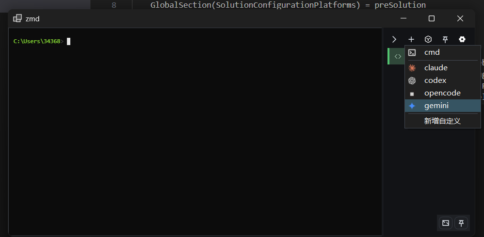
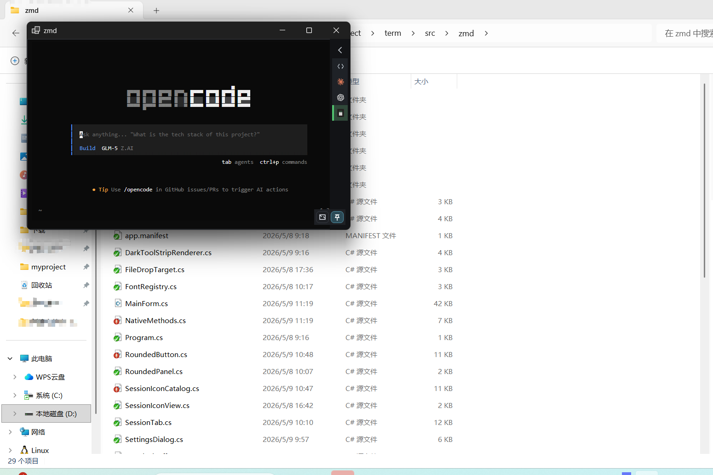
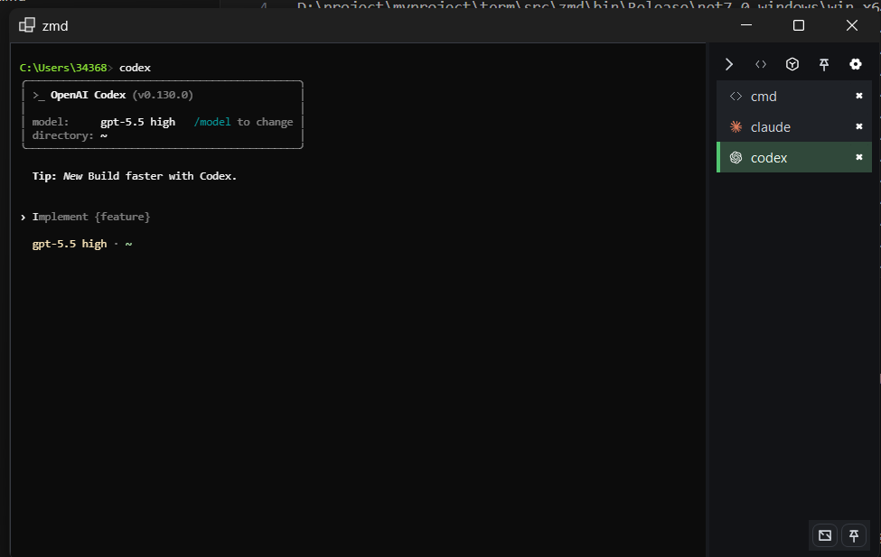
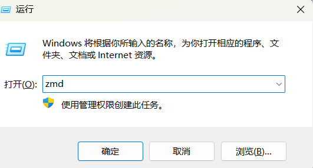

# zmd

轻量 Windows 第三方终端壳，目标是接近原生 `cmd` 的启动速度和简单度，同时改进字体、窗口布局和多会话体验。

## 这个项目是如何诞生的

- 最近vibecodeing的程度越来越高了，越发觉得还是cmd命令行终端更好用一些
- 在使用的过程中也发现了很多cmd不够完善的地方，而市面上的第三方终端软件像wave，我又感觉不够轻便没有打开的欲望

## 构建

轻便快捷，接近于原生cmd体验

- 侧边栏多窗口
- 窗口置顶
- 简洁模式
- 快捷打开ai终端

- 防偷窥，支持调整终端显示亮度
- 可通过win+r输入zmd直接打开

## 运行

下载exe文件，双击运行即可哦

